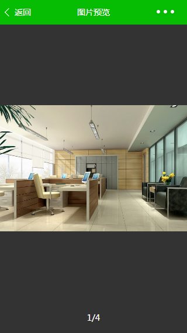
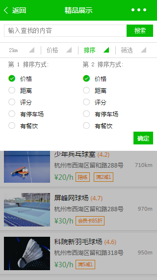

## wespace
> 微信小程序，场地（办公、会议、轰趴、运动......）租用平台。本程目前仅涉及是前端页面的代码，所有数据都源于js文件中的模拟数据，仅作为演示。

### 1. 功能简介

#### 1.1 主页
包括顶部的slider图，主题内容分为“精品办公”、“会议场所”、“运动场所”三部分内容。

#### 1.2 详情页
通过点击某个图片进入该场地的详情页面，包含顶部的图集（点击进入图片预览页面）、地图、评分、预定。

#### 1.3 图片预览
左右滑动查看图片。

#### 1.4 列表页
点击主页面的“全部精品”或“全部场所”进入列表页面，提供搜索功能，可选择地点、价格范围、排序方式、筛选条件。

#### 1.5 排序操作

#### 1.6 用户页面
用户界面主要包含“租用记录”、“我的收藏”、“我的评价”,“我的消息”内容。

#### 1.7 消息页面
支持左滑删除。

### 2. 功能演示

### 3. 补充说明

- 微信开发者工具版本：0.11.122100；
- 模拟器选择：IPhone5；
- 程序仅仅是前台的代码，数据为模拟数据；
- 后台采用nodejs搭建(未上传)；
- 感兴趣的可以download玩一下，欢迎star；
- 有问题请issue。